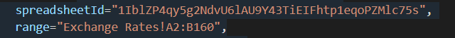
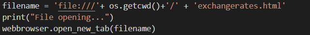
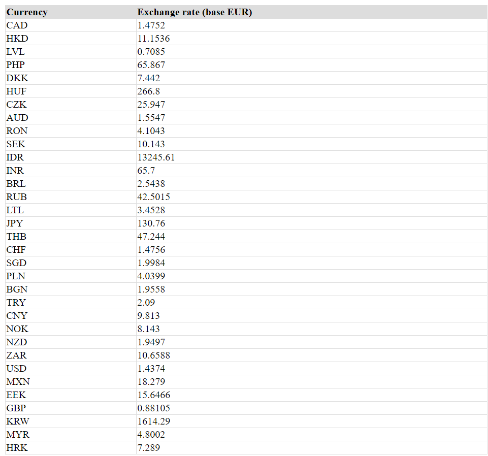
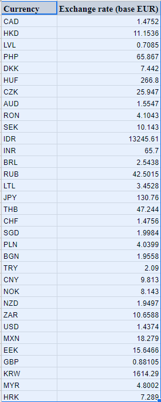

# Exchange-api-script
 
# Introduction
This project contains a script that allows you to pull exchange rates from the exchange api at https://exchangeratesapi.io/ with Euro as the base currency for the date - 2010-01-15.
When the script is run it does two things:
 #### Outputs a HTML File in the containing folder. The HTML contains a table with Currency Type and Exchange Rate Columns
 #### Inserts exchange rate values into a Google Spreadsheet. The Spreadsheet would contain the Currency Type and Exchange Rates.

# Prerequistes
 #### Install Python 3.8.2 on your PC or Mac which you can find at https://www.python.org/getit/
 You may get a "ModuleNotFound" error if you run the script against a lower version of Python.
 #### Confirm your installation by running the following command on your command line
 ```
python --version
```

# Getting the Script to Work
To get the script to work, you have to follow these instructions from Google here => https://developers.google.com/sheets/api/quickstart/python
#### Please note that the sample quickstart.py script has already been included in the repository
The authorization process that Google would take you through would allow you gain access to your Google Account and give the app read and write access to your Google Spreadsheets. This would then make it possible to choose/create a spreadsheet in your Google Drive where the exchange rates would be written to.
The HTML file would be written to the containing folder and would be opened by your default browser.

### Inputting Sheet Identity and Range


In the exchangeRequest.py file, input your Sheet Id and the range (Ln 58 & 59) where you want the exchange rates to be inputted.
Your Google Sheets Id is gotten from the Google Sheets url => https://docs.google.com/spreadsheets/d/***(SheetId)***





You can comment the above code (Ln 107-109) part of the code out if you do not want to have the HTML opened automatically on your browser

# Run the file
With these changes you can run the file with the following commands from your command line:

 ```
python exchangeRequest.py
```
Run it against the containing directory.

### If you use VS Code, you can also use the Run command

# Output


Above is the HTML File open in my default browser



Above is the result in my Google Spread Sheet


